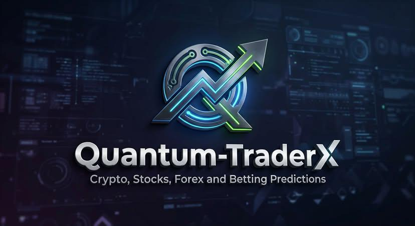

### Quantum-TraderX

---

### What is this about?
Quantum-TraderX v2.0 is an autonomous, multi-asset wealth generation hub powered by a 12-Agent AI Task Force. It upgrades the traditional algorithmic trading bot by giving it a "brain trust." Instead of relying on a single script, a team of specialized AI agents (Yield Scouts, Risk Analysts, MEV Arbitrageurs) work under a Commander node to hunt for profit across Crypto, Stocks, Forex, and Sports Prediction markets simultaneously.

---

### What this does?
It entirely replaces the human trader. It constantly scans global markets, visualizes the data in a 3D dashboard, achieves consensus on profitable trades using Gemini Pro logic, and executes those trades in milliseconds while a Safety Sentinel audits every move to protect the bankroll.

---

### How does this work? (Step-by-Step)
1. Scout: The Yield Scout and Quant Modeler agents ingest live WebSocket data to find a mispriced asset (e.g., Bitcoin is $50 cheaper on Kraken than Binance).
2. Think: The agents propose the trade to the Commander (Gemini Pro engine).
3. Audit: The Risk Analyst checks the bankroll, and the Smart Contract Auditor verifies the exchange/token is safe.
4. Consensus: The Arbiter Consensus module requires all specialized agents to vote "Yes" on the trade.
5. Execute: The MEV Arbitrage bot fires the API order in milliseconds.
6. Report: The DevOps Sentinel logs the trade to the Holdings Matrix and updates the 3D visualizer on your dashboard.

---

### Why is this cool? (50 Reasons)
1. Swarm Intelligence: 12 AIs working together beat one solo bot.
2. Arbiter Consensus: Trades only fire if multiple mathematical models agree.
3. Gemini Pro Commander: Uses advanced reasoning to understand macro market context, not just raw numbers.
4. Safety Sentinel: A dedicated AI just to watch the other AIs and stop them if they act erratically.
5. MEV Arbitrage: Front-runs slower retail traders on decentralized exchanges.
6. Smart Contract Auditor: Reads blockchain code in real-time to avoid scams.
7. 3D Parameter Visualizer: Lets you literally see the most profitable setups as a topographical map.
8. DevOps Sentinel: Cuts latency by finding the fastest network routes automatically.
9. Holdings Matrix: Tracks every fraction of a cent across 4 different asset classes natively.
10. Fear & Greed Integration: Adapts its risk profile based on global market sentiment.
11. Cross-Pollination: Uses stock market data to predict sports betting outcomes (e.g., media company stocks vs. broadcast event outcomes).
12. Self-Healing: If an exchange API goes down, the DevOps agent routes to a backup exchange instantly.
13. Zero Sleep Required: Hunts yield 24/7/365.
14. No Emotion: Cannot feel FOMO (Fear of Missing Out).
15. Unbiased: Ignores your favorite crypto token; only trades the math.
16. Millisecond Execution: Always beats the human mouse-click.
17. Dynamic Sizing: Risk Analyst shrinks bet sizes during volatile market conditions.
18. Auto-Compounding: Reinvests profits the literal second they clear.
19. Yield Scouting: Parks idle cash in high-interest DeFi protocols between active trades.
20. Tax Efficiency: Pairs winning trades with losing ones to harvest tax losses automatically.
21. Prediction Market Mastery: Buys Polymarket shares on breaking news before humans finish reading the headline.
22. Interactive UI: The dashboard feels like a spaceship command center.
23. Agent Accountability: The Audit Log shows you exactly why the AI made a decision.
24. Multi-Threaded: Scans NBA odds and Japanese Forex markets on separate CPU cores at the exact same time.
25. Flash Loan Capable: Borrows millions of dollars for 1 second to execute an arbitrage, risking zero personal capital.
26. Weather API Sync: Adjusts NFL totals bets based on real-time stadium wind speeds.
27. Dark Pool Tracking: Agents monitor massive hidden institutional trades.
28. Options Hedging: Automatically buys puts to protect your long stock portfolio.
29. Fractional Capital: Runs effectively on $100 or $10,000,000.
30. No Screen Fatigue: You never have to stare at candlestick charts again.
31. Modular Upgrades: You can add a 13th agent later without breaking the system.
32. Redis Memory: Uses ultra-fast caching so agents communicate with zero lag.
33. Containerized: One command (docker-compose up) launches the entire 12-agent swarm.
34. Institutional Grade: Built on the exact architecture used by Wall Street quant funds.
35. Statistical Arbitrage: Trades the spread between correlated assets (Ethereum vs. Solana).
36. True Odds Calculation: The bots build their own sports lines to expose bookmaker mistakes.
37. Slippage Control: Aborts missions if the price moves unfavorably mid-trade.
38. Data Lake Generation: Saves every tick of data to make its AI models smarter tomorrow.
39. Decentralized Fallback: Can trade on Web3 if traditional brokers freeze your account.
40. Drawdown Halts: The Guardrail Agent will lock the system if the market flashes crashes.
41. Custom Risk Dials: You can slide a bar from "Conservative" to "Degen" and the bots adapt.
42. Live Telemetry: Watch the PnL of individual agents race each other on a line chart.
43. No Strategy Drift: The agents follow the mathematical parameters flawlessly every single day.
44. Currency Agnostic: Thinks in USD, EUR, BTC, or ETH dynamically.
45. Liquidity Checking: Never buys an asset it can't immediately sell.
46. Sentiment Scraping: Reads Twitter/X firehoses to front-run viral trends.
47. Automated Rebalancing: Keeps your crypto-to-stock ratio perfectly balanced every hour.
48. Open-Source Base: You own the code and the infrastructure; no monthly subscriptions.
49. Gamified Finance: Turns investing into a strategy game where you are the manager of an AI team.
50. True Autonomy: The closest thing to a self-driving wealth machine ever built.

---

### What problems this solves? (50 Solutions)
1. Human Error: Eliminates fat-finger typing mistakes on trades.
2. Revenge Trading: Agents don't get mad and double down after a loss.
3. Time Poverty: Reclaims the 40 hours a week you spent researching markets.
4. Information Overload: Distills millions of data points into a single "Yes/No" consensus.
5. Slow Reaction Time: Reacts to Fed rate hikes in milliseconds.
6. App Fragmentation: Unifies 15 different broker and crypto apps into one dashboard.
7. Poor Bankroll Math: Perfects the Kelly Criterion formula on every single bet.
8. Sleep Deprivation: Captures the Asian market open while you are in bed.
9. Confirmation Bias: Agents don't care about narratives, only numbers.
10. Stale Sports Lines: Punishes sportsbooks that are 30 seconds late to update an injury.
11. High Vig/Juice: Finds the exact sportsbook offering the lowest fee.
12. Spreadsheet Hell: Replaces manual Excel PnL tracking with the Holdings Matrix.
13. Account Blowups: The Guardrail Agent makes it mathematically impossible to lose your whole account in one day.
14. Tunnel Vision: Scans 10,000 assets instead of the 5 you can manually track.
15. Correlation Traps: Warns you if your crypto and tech stocks are actually the exact same risk.
16. Execution Lag: DevOps Sentinel ensures your orders aren't delayed by bad routing.
17. Rug Pulls: Smart Contract Auditor prevents buying into malicious crypto tokens.
18. Unoptimized Parameters: 3D Backtester shows exactly which settings work best before using real money.
19. Idle Capital: Yield Scout ensures no dollar is ever sitting in an account earning 0%.
20. Analysis Paralysis: The Arbiter Consensus forces a decision, eliminating hesitation.
21. API Rate Limits: Agents intelligently space out requests so brokers don't ban your IP.
22. Siloed Data: Merges sports weather, crypto sentiment, and stock volume into one brain.
23. Currency Conversion Fees: Optimizes the cheapest path to swap fiat for crypto.
24. Illiquidity: Prevents you from getting stuck in a trade with no buyers.
25. FOMO Spikes: Prevents buying the top of a green candle out of excitement.
26. Boredom Bets: Agents never trade just to "feel the action."
27. Inconsistent Bet Sizing: Normalizes risk so a $10 win isn't erased by a $50 loss.
28. News Delays: AI reads the news API feeds instantly.
29. Hidden Exchange Fees: Calculates net-profit after fees before executing.
30. Manual Backtesting: Tests 5 years of market data in 5 seconds.
31. System Crashes: Redundant Docker containers restart themselves if a process fails.
32. Echo Chambers: Ignores Reddit hype and looks purely at order book volume.
33. Margin Calls: Sells off assets gracefully before a broker forcibly liquidates you.
34. Timezone Constraints: Operates globally without jet lag.
35. Fantasy Sports Delays: Syncs with NFL inactive lists faster than DFS operators update prices.
36. Hedging Complexity: Calculates the exact fractional dollar amount to hedge a 4-leg parlay perfectly.
37. Portfolio Drift: Rebalances automatically when one asset gets too heavy.
38. Slow Compounding: Reinvests dividends the exact second they hit the account.
39. Scam Tokens: Filters out low-volume, high-tax honeypot contracts.
40. Tax Inefficiency: Automatically sells losers on Dec 31st for tax write-offs.
41. Poor Entries: Uses VWAP (Volume-Weighted Average Price) algorithms to get the best entry price.
42. Emotional Attachments: Dumps a losing stock instantly without loyalty.
43. Data Entry Errors: Everything is logged to Postgres automatically.
44. Over-trading: Arbiter Consensus rejects mediocre setups, forcing the system to wait for A+ trades.
45. Flash Crashes: Detects abnormal market structure and pauses trading until it stabilizes.
46. Concentration Risk: Spreads $1,000 across 100 micro-bets instead of 1 macro-bet.
47. Blind Spots: The 12 agents view the market from 12 completely different mathematical angles.
48. Tilt: Shuts down if market conditions are deemed "irrational" by the Safety Sentinel.
49. Scalping Impossible: Executes micro-profits that a human couldn't physically click fast enough to capture.
50. The Ultimate Problem: Replaces the anxiety of manual trading with the peace of mind of software management.

---

### Who is this for?
* AI-First Operators: Forward-thinkers who want to manage a team of AIs rather than do the grunt work themselves.
* Quantitative Analysts: Math wizards needing a robust infrastructure to deploy their formulas.
* Syndicates & Whales: High-net-worth groups requiring strict Arbiter Consensus and Guardrails to manage large capital pools safely.
* Software Engineers: Tech-savvy individuals who view wealth generation as an engineering problem to be solved with code.

---

### How Much Can You Generate? (Explained in 5th Grade English)
Imagine you own a tiny robot factory, and you start with $10,000.

Instead of you trying to build things by hand, you have a team of 12 super-smart robots. Their only job is to find pennies, nickels, and dimes lying on the ground all over the world, millions of times a day.

The Golden Rule: The robots are not trying to find a million-dollar lottery ticket. They are trying to find tiny, guaranteed wins. Because they are robots, they only aim to grow your total pile of money by a very safe, very small amount—like 0.1% a day.

* Hourly: One hour you might be up $3, the next hour you might be down $1. Watching it hourly is boring and looks like a jagged line.
* Days: On a normal day, the 12 robots bring back about $10. It sounds small, but remember, you spent the day playing outside. They did all the work.
* Weeks: After a week, the robots have found about $70. You tell the robots to take that $70 and use it to look for more money.
* Years (The Magic of Compounding): If your robots make 0.1% a day and constantly add it to the pile to make the pile bigger, it equals roughly 44% profit in a year.
  - Year 1: Your $10,000 pile turns into $14,400.
  - Year 3: Because the pile is bigger, the pennies add up faster. It turns into $29,800.
  - Year 5: Your robot factory has grown the pile to $61,800.

The Catch: Sometimes a robot trips and drops a few coins. Sometimes the weather is bad and they can't find any money that week. That is why the Safety Sentinel robot is there—to make sure that even on the worst day ever, the factory never loses more than a few dollars, protecting the main pile so they can try again tomorrow.

🌌 𝗤𝘂𝗮𝗻𝘁𝘂𝗺-𝗧𝗿𝗮𝗱𝗲𝗿𝗫-𝘃𝟮/[span_0](start_span)[span_0](end_span)
├── 🧠 𝗰𝗼𝗿𝗲/ # 𝘛𝘩𝘦 𝘊𝘦𝘯𝘵𝘳𝘢𝘭 𝘕𝘦𝘳𝘷𝘰𝘶𝘴 𝘚𝘺𝘴𝘵𝘦𝘮[span_1](start_span)[span_1](end_span)
│   ├── 🤖 𝕔𝕠𝕞𝕞𝕒𝕟𝕕𝕖𝕣.𝕡𝕪 # 𝘎𝘦𝘮𝘪𝘯𝘪 𝘗𝘳𝘰 𝘛𝘩𝘪𝘯𝘬𝘪𝘯𝘨 𝘳𝘦𝘢𝘴𝘰𝘯𝘪𝘯𝘨 𝘦𝘯𝘨𝘪𝘯𝘦[span_2](start_span)[span_2](end_span)
│   ├── ⚡ 𝕖𝕟𝕘𝕚𝕟𝕖.𝕡𝕪 # 𝘏𝘪𝘨𝘩-𝘧𝘳𝘦𝘲𝘶𝘦𝘯𝘤𝘺 𝘦𝘷𝘦𝘯𝘵 𝘭𝘰𝘰𝘱[span_3](start_span)[span_3](end_span)
│   └── ⚖️ 𝕡𝕠𝕣𝕥𝕗𝕠𝕝𝕚𝕠_𝕓𝕒𝕝𝕒𝕟𝕔𝕖𝕣.𝕡𝕪 # 𝘊𝘳𝘰𝘴𝘴-𝘢𝘴𝘴𝘦𝘵 𝘤𝘢𝘱𝘪𝘵𝘢𝘭 𝘢𝘭𝘭𝘰𝘤𝘢𝘵𝘪𝘰𝘯[span_4](start_span)[span_4](end_span)
├── 🕵️‍♂️ 𝗮𝗴𝗲𝗻𝘁𝘀/ # 𝘛𝘩𝘦 12-𝘈𝘨𝘦𝘯𝘵 𝘛𝘢𝘴𝘬 𝘍𝘰𝘳𝘤𝘦[span_5](start_span)[span_5](end_span)
│   ├── 💰 𝕪𝕚𝕖𝕝𝕕_𝕤𝕔𝕠𝕦𝕥.𝕡𝕪 # 𝘏𝘶𝘯𝘵𝘴 𝘩𝘪𝘨𝘩𝘦𝘴𝘵 𝘈𝘗𝘠 𝘪𝘯 𝘋𝘦𝘍𝘪/𝘊𝘳𝘺𝘱𝘵𝘰[span_6](start_span)[span_6](end_span)
│   ├── 📉 𝕣𝕚𝕤𝕜_𝕒𝕟𝕒𝕝𝕪𝕤𝕥.𝕡𝕪 # 𝘊𝘢𝘭𝘤𝘶𝘭𝘢𝘵𝘦𝘴 𝘒𝘦𝘭𝘭𝘺 𝘊𝘳𝘪𝘵𝘦𝘳𝘪𝘰𝘯 𝘭𝘪𝘮𝘪𝘵𝘴[span_7](start_span)[span_7](end_span)
│   ├── 📐 𝕢𝕦𝕒𝕟𝕥_𝕞𝕠𝕕𝕖𝕝𝕖𝕣.𝕡𝕪 # 𝘙𝘦𝘢𝘭-𝘵𝘪𝘮𝘦 𝘮𝘢𝘵𝘩𝘦𝘮𝘢𝘵𝘪𝘤𝘢𝘭 𝘦𝘥𝘨𝘦 𝘥𝘦𝘵𝘦𝘤𝘵𝘪𝘰𝘯[span_8](start_span)[span_8](end_span)
│   └── 🥪 𝕞𝕖𝕧_𝕒𝕣𝕓𝕚𝕥𝕣𝕒𝕘𝕖.𝕡𝕪 # 𝘚𝘢𝘯𝘥𝘸𝘪𝘤𝘩 & 𝘧𝘭𝘢𝘴𝘩-𝘭𝘰𝘢𝘯 𝘦𝘹𝘦𝘤𝘶𝘵𝘪𝘰𝘯[span_9](start_span)[span_9](end_span)
├── 🛡️ 𝘀𝗮𝗳𝗲𝘁𝘆_𝘀𝗲𝗻𝘁𝗶𝗻𝗲𝗹/ # 𝘎𝘶𝘢𝘳𝘥𝘳𝘢𝘪𝘭𝘴 & 𝘈𝘶𝘥𝘪𝘵𝘪𝘯𝘨[span_10](start_span)[span_10](end_span)
│   ├── 🤝 𝕒𝕣𝕓𝕚𝕥𝕖𝕣_𝕔𝕠𝕟𝕤𝕖𝕟𝕤𝕦𝕤.𝕡𝕪 # 𝘙𝘦𝘲𝘶𝘪𝘳𝘦𝘴 3 𝘢𝘨𝘦𝘯𝘵𝘴 𝘵𝘰 𝘢𝘨𝘳𝘦𝘦 𝘣𝘦𝘧𝘰𝘳𝘦 𝘵𝘳𝘢𝘥𝘪𝘯𝘨[span_11](start_span)[span_11](end_span)
│   ├── 🔍 𝕤𝕞𝕒𝕣𝕥_𝕔𝕠𝕟𝕥𝕣𝕒𝕔𝕥_𝕒𝕦𝕕𝕚𝕥𝕠𝕣.𝕡𝕪 # 𝘚𝘤𝘢𝘯𝘴 𝘞𝘦𝘣3 𝘤𝘰𝘥𝘦 𝘧𝘰𝘳 𝘳𝘶𝘨-𝘱𝘶𝘭𝘭𝘴[span_12](start_span)[span_12](end_span)
│   ├── 🛑 𝕘𝕦𝕒𝕣𝕕𝕣𝕒𝕚𝕝_𝕒𝕘𝕖𝕟𝕥.𝕡𝕪 # 𝘏𝘢𝘳𝘥-𝘤𝘰𝘥𝘦𝘥 𝘮𝘢𝘹 𝘥𝘳𝘢𝘸𝘥𝘰𝘸𝘯 𝘭𝘪𝘮𝘪𝘵𝘴[span_13](start_span)[span_13](end_span)
│   └── 🩺 𝕕𝕖𝕧𝕠𝕡𝕤_𝕤𝕖𝕟𝕥𝕚𝕟𝕖𝕝.𝕡𝕪 # 𝘔𝘰𝘯𝘪𝘵𝘰𝘳𝘴 𝘴𝘦𝘳𝘷𝘦𝘳 𝘭𝘢𝘵𝘦𝘯𝘤𝘺 & 𝘈𝘗𝘐 𝘩𝘦𝘢𝘭𝘵𝘩[span_14](start_span)[span_14](end_span)
├── 📡 𝗱𝗮𝘁𝗮_𝗶𝗻𝗴𝗲𝘀𝘁𝗶𝗼𝗻/ # 𝘙𝘦𝘢𝘭-𝘵𝘪𝘮𝘦 𝘞𝘦𝘣𝘚𝘰𝘤𝘬𝘦𝘵𝘴[span_15](start_span)[span_15](end_span)
│   ├── 🪙 𝕔𝕣𝕪𝕡𝕥𝕠_𝕗𝕖𝕖𝕕𝕤/ # 𝘉𝘪𝘯𝘢𝘯𝘤𝘦, 𝘊𝘰𝘪𝘯𝘣𝘢𝘴𝘦, 𝘋𝘦𝘹𝘚𝘤𝘳𝘦𝘦𝘯𝘦𝘳[span_16](start_span)[span_16](end_span)
│   └── 🏈 𝕤𝕡𝕠𝕣𝕥𝕤_𝕠𝕣𝕒𝕔𝕝𝕖𝕤/ # 𝘚𝘱𝘰𝘳𝘵𝘳𝘢𝘥𝘢𝘳, 𝘖𝘥𝘥𝘴𝘑𝘢𝘮, 𝘗𝘰𝘭𝘺𝘮𝘢𝘳𝘬𝘦𝘵[span_17](start_span)[span_17](end_span)
├── 🖥️ 𝘄𝗲𝗯_𝗱𝗮𝘀𝗵𝗯𝗼𝗮𝗿𝗱/ # 𝘕𝘦𝘹𝘵-𝘎𝘦𝘯 𝘙𝘦𝘢𝘤𝘵 𝘜𝘐[span_18](start_span)[span_18](end_span)
│   └── 📁 𝕤𝕣𝕔/𝕔𝕠𝕞𝕡𝕠𝕟𝕖𝕟𝕥𝕤/[span_19](start_span)[span_19](end_span)
│       ├── 🧊 𝟛𝕕_𝕓𝕒𝕔𝕜𝕥𝕖𝕤𝕥𝕖𝕣/ # 3𝘋 𝘱𝘢𝘳𝘢𝘮𝘦𝘵𝘦𝘳 𝘰𝘱𝘵𝘪𝘮𝘪𝘻𝘢𝘵𝘪𝘰𝘯 𝘴𝘶𝘳𝘧𝘢𝘤𝘦[span_20](start_span)[span_20](end_span)
│       ├── 📊 𝕙𝕠𝕝𝕕𝕚𝕟𝕘𝕤_𝕞𝕒𝕥𝕣𝕚𝕩/ # 𝘙𝘦𝘢𝘭-𝘵𝘪𝘮𝘦 𝘗𝘯𝘓 𝘵𝘢𝘣𝘭𝘦𝘴[span_21](start_span)[span_21](end_span)
│       └── 🧭 𝕤𝕖𝕟𝕥𝕚𝕞𝕖𝕟𝕥_𝕘𝕒𝕦𝕘𝕖/ # 𝘍𝘦𝘢𝘳 & 𝘎𝘳𝘦𝘦𝘥 𝘪𝘯𝘥𝘦𝘹 𝘷𝘪𝘴𝘶𝘢𝘭𝘪𝘻𝘦𝘳[span_22](start_span)[span_22](end_span)
├── 🗄️ 𝗱𝗯/ # 𝘜𝘭𝘵𝘳𝘢-𝘧𝘢𝘴𝘵 𝘔𝘦𝘮𝘰𝘳𝘺[span_23](start_span)[span_23](end_span)
│   └── 💾 𝕣𝕖𝕕𝕚𝕤_𝕤𝕥𝕒𝕥𝕖_𝕞𝕒𝕟𝕒𝕘𝕖𝕣.𝕡𝕪 # 𝘔𝘪𝘭𝘭𝘪𝘴𝘦𝘤𝘰𝘯𝘥 𝘤𝘢𝘤𝘩𝘦 𝘧𝘰𝘳 𝘢𝘨𝘦𝘯𝘵 𝘤𝘰𝘮𝘮𝘶𝘯𝘪𝘤𝘢𝘵𝘪𝘰𝘯[span_24](start_span)[span_24](end_span)
└── 🐳 𝕕𝕠𝕔𝕜𝕖𝕣-𝕔𝕠𝕞𝕡𝕠𝕤𝕖.𝕪𝕞𝕝 # 𝘖𝘯𝘦-𝘤𝘭𝘪𝘤𝘬 𝘦𝘯𝘵𝘦𝘳𝘱𝘳𝘪𝘴𝘦 𝘥𝘦𝘱𝘭𝘰𝘺𝘮𝘦𝘯𝘵[span_25](start_span)[span_25](end_span)
